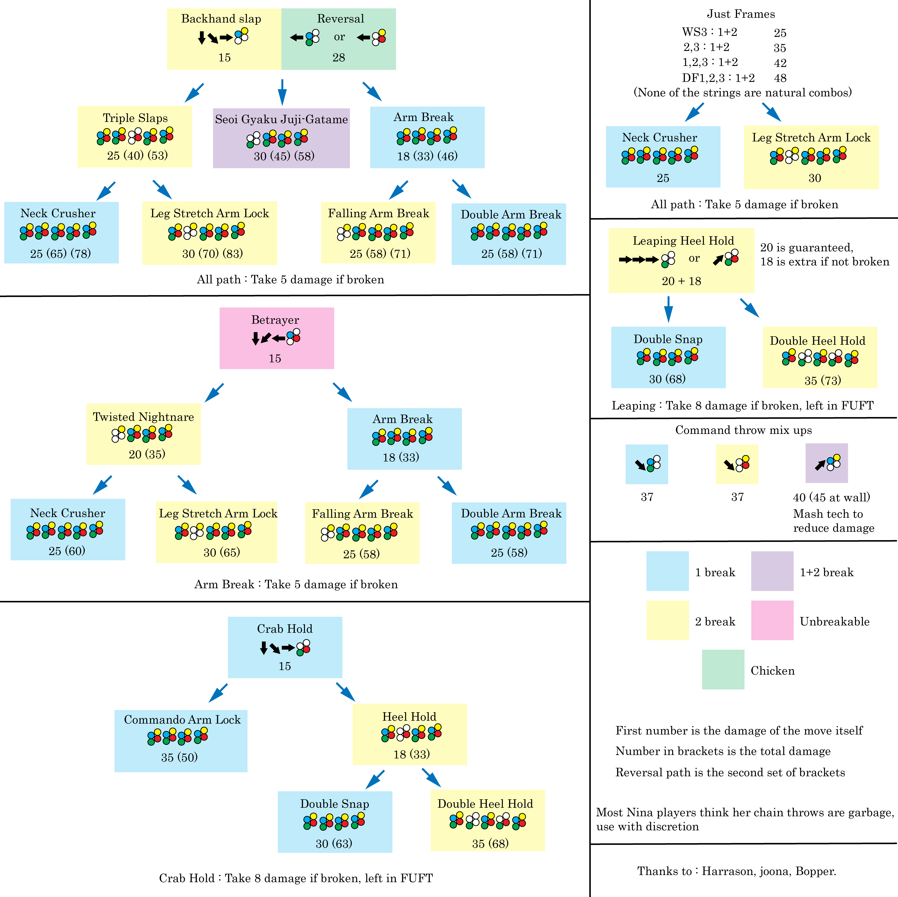

## Fighting Games

I've recently gotten into this fighting game called Tekken 7. It was initially released in 2015 so it's been out for quite a while, but there's still a very large fanbase. There's lots of different playable characters to choose from and each character has a huge list of unique moves. There's only four moving buttons and four attacking buttons but different sequences and combinations of button presses leads to lots of different combos you can do. The average number of moves per character is 96 (that's not even including the combos yet). Besides learning the moves, there's also lots of other things to think about like how to counter other moves and what moves are faster than others. Because of this, it can be hard for a new player to know exactly what to do in a given situation. With design patterns, this learning curve becomes much less steep.

 
 
## Design Patterns in Tekken

A design pattern is a general solution to a common problem that has been developed previously by experts in the field. In our case, the experts are going to be all those guys who have spent thousands of hours playing this game since it got released in 2015. For pretty much every character, there are at least hundreds of people who have tested and calculated the most efficient combo for situations like the enemy whiffing a high kick. As a new player, learning this combo makes the most sense. Using these design patterns allows you to play at a mid-high level really quickly. Of course, to become better you're going to have to learn how to adapt the design patterns to more specific scenarios, but it gives you a great place to start.

A really complicated flow chart of some grab combos.

## Design Patterns in Software Engineering

As a new software engineer, the learning curve can get quite intimidating. There are so many different software tools and each would probably take years to fully master. However, time is never really a luxury in the industry. Using a github template like [meteor-template-react](https://github.com/ics-software-engineering/meteor-application-template-react), I can quickly get the basis of my product stable and running. The rest is up to me to adapt the design pattern to the specific problem. I think I stand a fighting chance.
