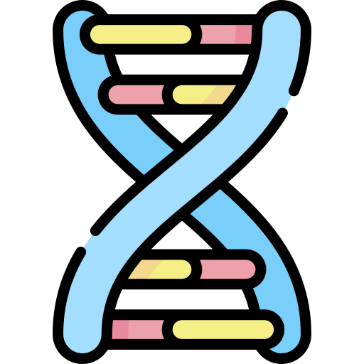

## How I got here &nbsp;&nbsp;&nbsp;&nbsp;&nbsp;&nbsp;&nbsp;&nbsp;&nbsp;&nbsp;&nbsp;&nbsp;&nbsp;&nbsp;&nbsp;&nbsp;&nbsp;&nbsp;&nbsp;&nbsp;&nbsp;

&nbsp;&nbsp;&nbsp;&nbsp;&nbsp;&nbsp; Coming from a biochemistry background, I entered the software engineering world in a sort-of atypical kind of way. I started my college career studying the inner workings of cells. I learned the chemical and molecular processes that drive our existence. But while listening to these lectures on cellular metabolism, I was always amazed at how scientists were able to examine these nanoscopic structures with such rigor. I think this is where my interest in software engineering began.

&nbsp;&nbsp;&nbsp;&nbsp;&nbsp;&nbsp; This past summer I participated in a series of bioinformatics workshops designed to teach students how to perform bioinformatics searches, analysis, and alignment in R using the Bioconductor package. This experience made me realize how important software development is in research. With Bioconductor, I can retrieve data on whatever protein structures, DNA/RNA strands, and genes I want. I can perform gene expression studies through RNA sequencing. The amount of utility that software provides for researchers is incredible. 

## My goals for ICS 314: Software Engineering
&nbsp;&nbsp;&nbsp;&nbsp;&nbsp;&nbsp; My goal for this software engineering class is to get comfortable enough with the tools in software development to understand and contribute to open source research software. I want to create something that scientists all over the world can use to make great discoveries in their fields. Like how Iron Man has his suit that gives him augmented abilities, I want to give scientists the superpowers to create great change for future generations. 
 
 
Icons made by <a href="https://www.flaticon.com/authors/freepik" title="Freepik">Freepik</a> from <a href="https://www.flaticon.com/" title="Flaticon"> www.flaticon.com</a>
