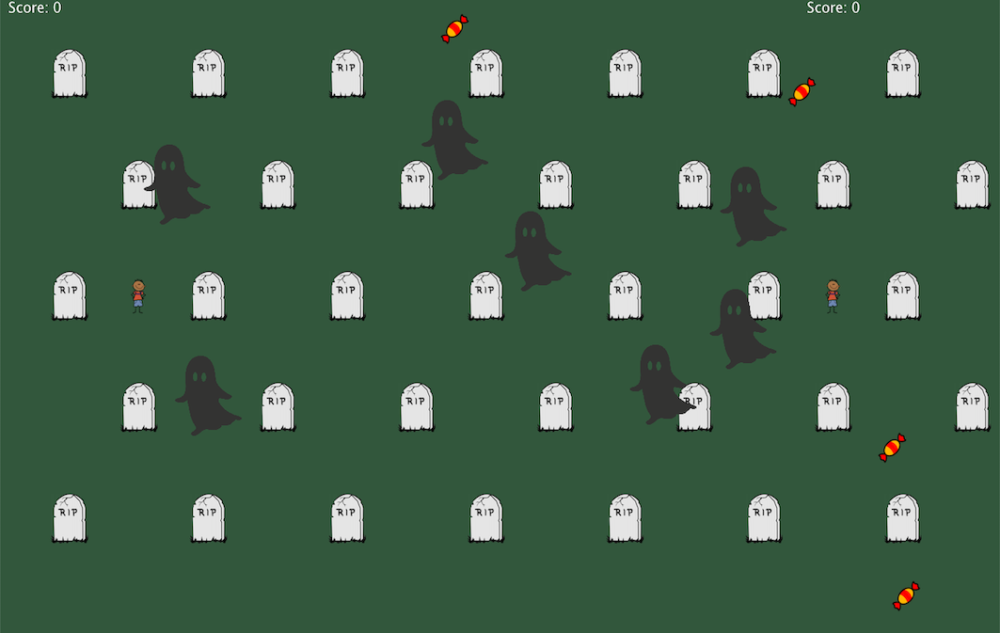

  
  

This was a the final project I completed for ICS 111. The goal of the game is to avoid the graves and ghosts while collecting the moving candies. The player that collects the most candies while not bumping into the obstacles wins.

The goal of the project was to get used to working with the skills we learned in class which included file parsing, class structure, private/public member variables and member functions. 

[Library Documentation](http://www2.hawaii.edu/~dylank/ics111/doc/)

Source: <a href="https://github.com/airyclam/CandyGame"><i class="large github icon"></i>airyclam/CandyGame</a>

